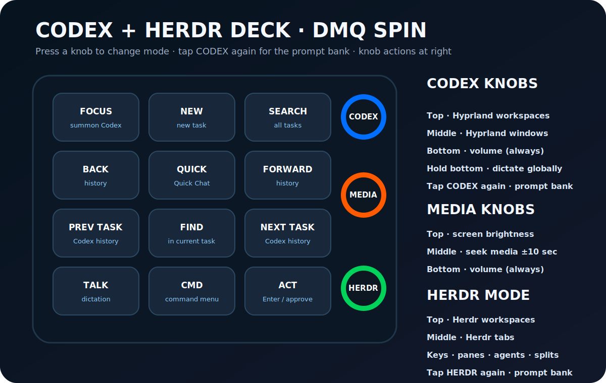

# Codex + Herdr Deck for the DMQ Design SPIN

This turns the connected 12-key, three-encoder SPIN macro pad into a global
control surface for Codex Desktop, Hyprland, and Herdr. It keeps the user's two
fixed media controls—bottom-knob volume and the bottom-row transport buttons—
while giving every other control a real job.



## The three modes

Press one of the three encoder knobs to select a mode. The whole deck takes on
the mode color, with its selector brightest: top/blue for **Codex**,
middle/amber for **Media**, and bottom/green for **Herdr**. Turning the bottom
knob always controls volume, regardless of mode.

### Codex mode (blue)

|            |            |            |
|------------|------------|------------|
| Focus      | New task   | Search     |
| Back       | Quick Chat | Forward    |
| Prev task  | Find       | Next task  |
| Dictation  | Command    | Enter/Act  |

- Top knob: previous/next open Hyprland workspace
- Middle knob: previous/next window on the current workspace
- Bottom knob: volume down/up

Tap the top knob to enter Codex mode. Hold the **bottom knob** in any mode to record global
dictation; release to transcribe locally and type at the current cursor. The
dedicated Dictation key toggles recording when tap-to-start/tap-to-stop is more
convenient.

Every action first verifies that Codex actually has focus. If focus fails, the
helper refuses to type into another app.

### Media mode (amber)

|             |      |              |
|-------------|------|--------------|
| Home        | Up   | End          |
| Left        | Down | Right        |
| Page Up     | Mute | Page Down    |
| Play/Pause  | Previous | Next     |

- Top knob: screen brightness down/up
- Middle knob: seek active media backward/forward 10 seconds
- Bottom knob: volume down/up

### Herdr mode (green)

|              |                |               |
|--------------|----------------|---------------|
| Focus Herdr  | New workspace  | New tab       |
| Pane left    | Pane up        | Pane right    |
| Prev agent   | Pane down      | Next agent    |
| Split right  | Zoom pane      | Split down    |

The Herdr helper uses its local socket API rather than injecting prefix-key
sequences into a terminal. New workspaces and tabs inherit the focused pane's
working directory.

- Top knob: previous/next Herdr workspace
- Middle knob: previous/next Herdr tab
- Bottom knob: volume down/up

Tap the bottom knob to enter Herdr mode; hold it to dictate instead.

## Install and build

### Requirements

- Linux with Hyprland
- A DMQ Design SPIN and a local QMK checkout (by default `~/qmk_firmware`)
- `git`, `make`, an AVR QMK toolchain, `hyprctl`, `jq`, `ydotool`, and
  `playerctl`
- For offline dictation: `cmake`, a C/C++ compiler, `curl`, `parec`, and
  `ffmpeg`; NVIDIA CUDA is used automatically when `nvcc` is available
- Codex Desktop and Herdr for their respective modes

Override the QMK checkout or revision with `QMK_SOURCE` and `QMK_REF`.

The installer creates symlinks for the helper, Hyprland bindings, and QMK
keymap. It appends one `source` line to the existing user Hyprland config and
compiles the firmware in an isolated, current QMK worktree. Your existing
dirty QMK checkout is not modified. The installer does **not** flash unless
explicitly requested.

```bash
./install.sh
make dictation
```

Run diagnostics at any time:

```bash
make doctor
```

Flash after putting the SPIN into its ATmega32U4 bootloader:

```bash
make flash
```

For the first install, when the flasher starts waiting, use the board's physical
reset control (or briefly bridge `RST` and `GND`) to enter the bootloader. Once
this firmware is installed, holding all three knobs for four seconds enters the
bootloader; all LEDs turn red first. The helper resets the board back into the
deck firmware after a successful write.

## Development

```bash
make test
make build
```

Set `KBD_CODEX_DRY_RUN=1` to print an action instead of focusing or typing:

```bash
KBD_CODEX_DRY_RUN=1 bin/kbd-codex review
```

The QMK firmware only emits uncommon `F13`–`F24` signals. Desktop behavior
lives in `hypr/codex-numpad.conf`, `bin/kbd-codex`, and `bin/kbd-herdr`, so most
actions can be changed without reflashing the board.

Dictation prefers a connected Razer Seiren Mini, falls back to the default
PulseAudio source, and runs a local `whisper.cpp` model. No recording is
uploaded. Override the microphone with `KBD_DICTATE_SOURCE`, or the default
`base.en` model with `KBD_DICTATE_MODEL`.
